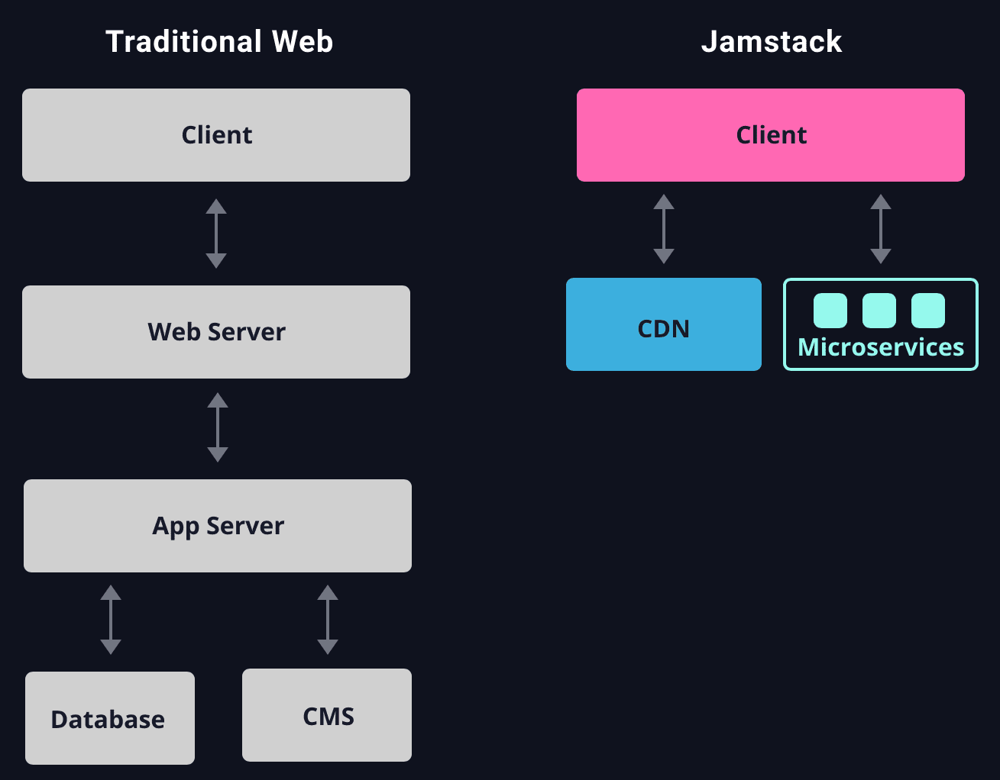

<h1>Deploy application to Clouds</h1>

CMS stands for Content Management System.

## Keywords:
Jamstack, Netlify, FaunaDB, Firebase

## provider
* [WordPress](https://wordpress.com)
* [Wix](https://www.wix.com)
* [Squarespace](https://www.squarespace.com)
* [Bluehost](https://www.bluehost.com)
* [GoDaddy](https://www.godaddy.com)
* [Weebly](https://www.weedly.com)
* [Netlify CMS](https://www.netlifycms.org)
* [Wagtail](https://wagtail.io)
* [Lektor](https://getlektor.com)



* [deploy python to netlify](https://testdriven.io/blog/static-site-flask-and-netlify/)

```dos
(env) C:\Users\12818\workspace\students\hongkai\react\micedb>pip freeze > requirements.txt
```

* [pip freeze > requirements.txt](requirements.txt)